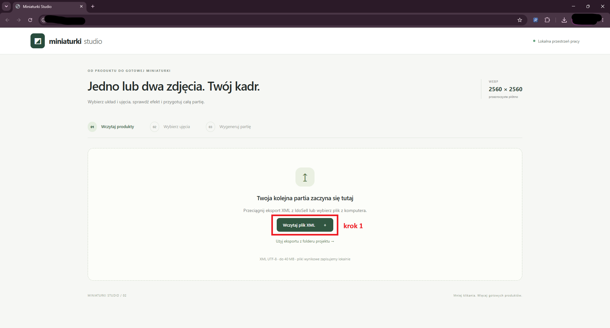
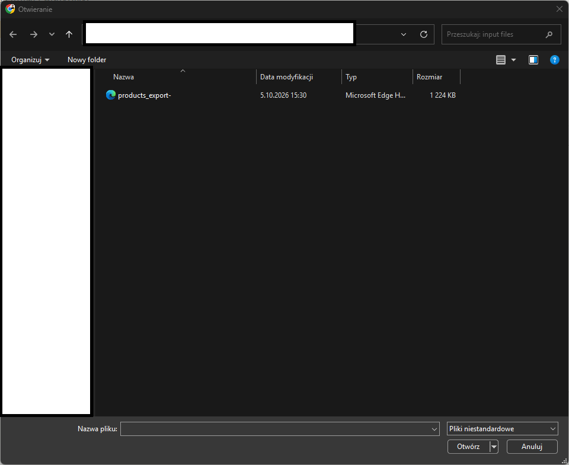
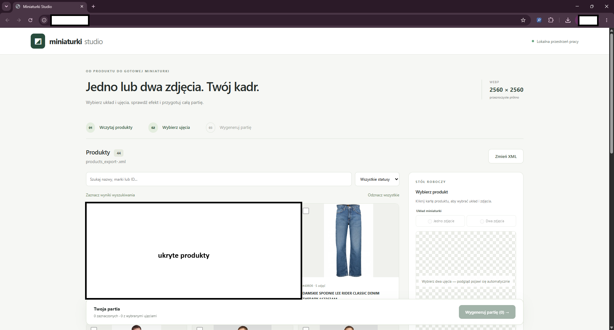
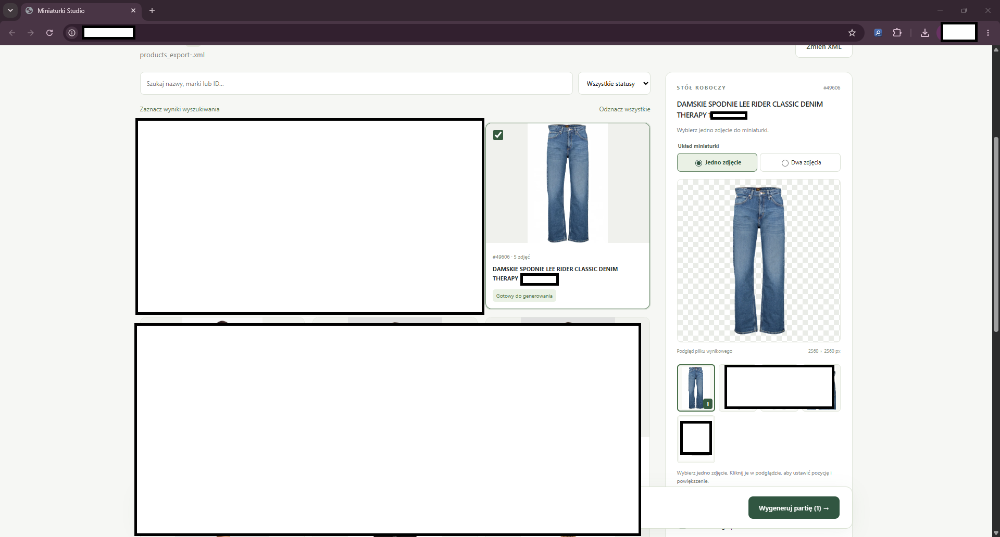
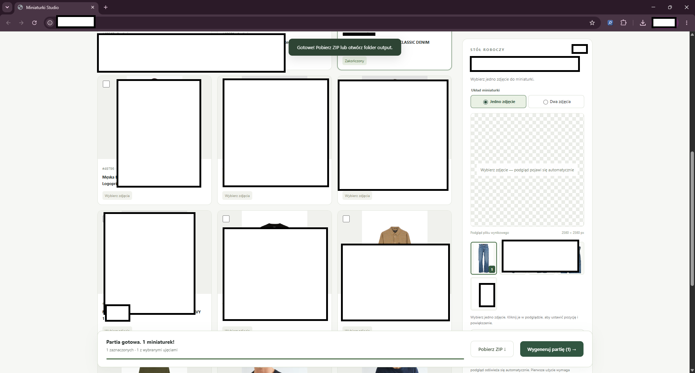
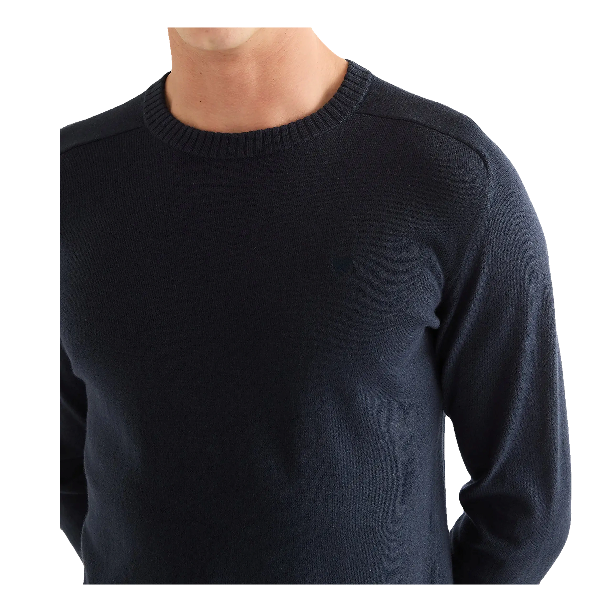

# Miniaturki Studio

Lokalna aplikacja webowa do przygotowywania miniaturek produktów z eksportu XML IdoSell. Pozwala wybrać zdjęcia, ustawić kadr, sprawdzić podgląd i wygenerować całą partię plików WebP.

## Problem i rozwiązanie

Przy dużym katalogu ręczne wybieranie zdjęć i przygotowywanie każdej miniaturki osobno zajmuje dużo czasu. Miniaturki Studio łączy te kroki w jednym interfejsie: wczytuje produkty z XML, pozwala ustawić kompozycję dla każdego z nich, a następnie przetwarza zaznaczoną partię i udostępnia wyniki w ZIP.

## Funkcje

- Import eksportu XML IdoSell (UTF-8, do 40 MB) oraz wyszukiwanie produktów po nazwie, marce lub ID.
- Układ z jednym zdjęciem lub dwoma różnymi ujęciami, z możliwością zmiany ich kolejności.
- Ustawianie pozycji i powiększenia zdjęć oraz automatycznie odświeżany podgląd.
- Opcjonalne usuwanie tła osobno dla każdego produktu za pomocą lokalnego modelu U2Net.
- Eksport miniaturek WebP na przezroczystym płótnie 2560 × 2560 px; gotowe pliki można pobrać w ZIP. Błąd pojedynczego produktu nie przerywa całej partii.

## Stack

- **Backend:** Python 3.11+, lokalny serwer HTTP i przetwarzanie XML w `app.py`.
- **Obrazy:** Pillow, `rembg[cpu]` i ONNX Runtime (model U2Net).
- **Frontend:** HTML, CSS i JavaScript bez frameworka (`static/`).

## Workflow / Jak to działa

1. **Wczytanie danych.** Użytkownik klika **Wczytaj plik XML**; aplikacja otwiera wybór pliku eksportu.

   

2. **Wybór eksportu.** Użytkownik wskazuje plik XML na dysku; po otwarciu aplikacja może wczytać zawarte w nim produkty.

   

3. **Przegląd produktów.** Po imporcie użytkownik widzi listę produktów oraz pole wyszukiwania i filtr statusu; może znaleźć produkt do przygotowania.

   

4. **Ustawienie miniaturki.** Użytkownik wybiera produkt, układ i zdjęcie oraz może dopasować kadr; podgląd pokazuje planowany wynik, a produkt trafia do partii.

   

5. **Generowanie partii.** Użytkownik klika **Wygeneruj partię**; po zakończeniu widzi status i może pobrać gotowe pliki przyciskiem **Pobierz ZIP**.

   

6. **Plik wynikowy.** Użytkownik otwiera wygenerowany WebP; otrzymuje miniaturkę 2560 × 2560 px na przezroczystym tle. Poniżej przykład rezultatu.

   

## Uruchomienie

Wymagane są Python **3.11+**, współczesna przeglądarka oraz eksport XML IdoSell z adresami zdjęć HTTP(S). Pobieranie zdjęć wymaga internetu; pierwsze użycie usuwania tła pobiera model U2Net (około 176 MB).

W PowerShell, z katalogu projektu:

```powershell
py -3.11 -m venv .venv
.\.venv\Scripts\Activate.ps1
python -m pip install -r requirements.txt
python app.py --open
```

Aplikacja działa pod adresem <http://127.0.0.1:8765>. Port można zmienić, np. `python app.py --open --port 8766`. W Windows dostępny jest także `start.bat`, który sprawdza zależności, instaluje je w razie potrzeby i otwiera aplikację.

Plik XML można wczytać z komputera albo umieścić w lokalnym katalogu `input files/` i użyć opcji importu z folderu projektu. Wyniki są zapisywane w `output/<ID_PARTII>/`; aplikacja udostępnia też archiwum ZIP. Własne eksporty XML i wygenerowane pliki nie powinny trafiać do publicznego repozytorium.

## Testy

```powershell
python -m unittest discover -s tests -v
```

## Ograniczenia

- Import wymaga zgodnego pliku XML i poprawnych adresów zdjęć. Układ z dwoma ujęciami wymaga dwóch różnych zdjęć.
- Automatyczne usuwanie tła może wymagać ręcznej kontroli efektu w podglądzie.
- Wybory i ustawienia kadru są przechowywane w bieżącej karcie przeglądarki; odświeżenie strony je resetuje. Zapisane wcześniej pliki pozostają na dysku.

